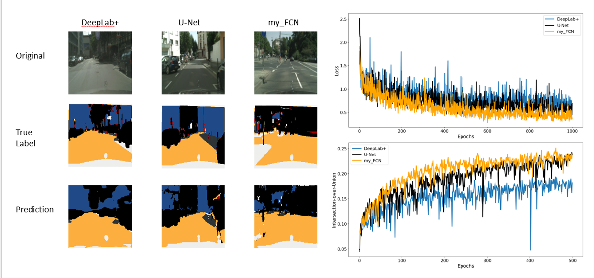

# Image Segmentation on Cityscapes Dataset

## Objective

The motivation for this project is to test the possibility of CNN image segmentation using an ordinary laptop with 8GB visual memory and explore methods to increase model accuracy and efficiency within this limitation. 

## baseline model
I choose the standard UNet and the baseline model using the setup from kerrgarr : https://github.com/kerrgarr/SemanticSegmentationCityscapes

## dataset
**Cityscapes: Semantic Understanding of Urban Street Scenes.** https://www.cityscapes-dataset.com/downloads
the dataset contains annotated cityscape dataset in Germany with various weather conditions.

___________________________________


## Logging on TensorBoard

If you want to use Tensorboard, here is some extra code:

<code> python -m seg_code.train -m my_fcn --log_dir myfcn_test -n 500 </code>

followed by:

<code> tensorboard --logdir=myfcn_test --port 6006 --bind_all  </code>
             
the message you'll receive will give you something like:

<code> http://your-Laptop-name:6006/ </code>

click on the address you get and open it in a web browser. See the interactive tensorboard. Done! :)

The results that I've collected according to the details in Table 1 are shown in Figure 5. (These data and images were taken from TensorBoard results.)


Figure 5. Model performance. Comparison of segmentation maps predicted for each of the models (DeepLabV3+, U-Net, and my_FCN) after 500 epochs are shown in the left-side panel. The right-side panel shows the evolution of the training loss (top right) and IoU values on the validation data (bottom right).

____________________________
## To-DO List

Clearly the results above aren't superb. To improve the models' results, using the full dataset would of course be advantageous. Furthermore, increasing the input image resolution would likely improve the results (the data augmentation techniques used here may be too aggressive). However, for my experiments with increasing the image resolution I also had to decrease the **batch size to 2** to prevent CUDA out of memory errors (you may not encounter this issue on your system). 

To use the full dataset, simply choose "full" in the create_directories function in Create_Data.ipynb file.

For example:
 
```
create_directories(gtFineDIR_train, DEST_ROOT_Train, "full") 
create_directories(ImgDIR_train, DEST_ROOT_Train, "full")
```


Running on the full dataset will increase the runtime, but will require fewer epochs to achieve more accurate results. More data is better than more epochs. :) 
 
 Here are a few ideas to try:
 
- [ ] Increase the dataset size
- [ ] Increase input image resolution
- [ ] Implement learning rate scheduler
- [ ] Try different data augmentation techniques (or choose none at all)
- [ ] Change the batch size
- [ ] Test out a different encoder in DeepLab architecture

** Personal Motivation **

In doing this work, the main questions I wanted to answer for myself were:

* How practical is it to run a semantic segmentation model on a **real-world dataset** using my gaming laptop (1 GPU) ? 
  (**Answer:** Quite practical and many people do it this way; however, I ran into CUDA out-of-memory errors when trying to work with high-res inputs.)

* How easy is it to **find and download an interesting dataset** for this task ? How much useful data is available for free ? 
  (**Answer:** Not nearly as easy as I thought and many datasets require you to jump through hoops to download them; still, there are some interesting datasets out there if you search hard enough.)

* How easy is it to **construct and understand** a semantic segmentation model ? 
  (**Answer:** UNet is fairly straightforward; DeepLabV3+ is less so and involves many layers and modules.)

* What semantic segmentation models are currently considered **state-of-the-art** ? How do these perform when compared to a simple UNet ? 
  (**Answer:** DeepLabV3+, ERFNet, PSPNet, etc. have been developed most recently (circa 2018); I focused on DeepLabV3+ here. The DeepLab models are optimized for learning on high-resolution data, which unfortunately may require more substantial VRAM than my current laptop's hardware. Consequently, DeepLabV3+ did not outperform UNet in this current study since this work was based on using very low-res inputs.)
  
## Thank you for checking out my repo!
____________________________________________________________________________________
## References:

Cordts, M., Omran, M., Ramos, S., Benenson, R., Rehfeld, T., Roth, S., & Schiele, B. (2016). The Cityscapes Dataset for Semantic Urban Scene Understanding. Proc. of the IEEE Conference on Computer Vision and Pattern Recognition (CVPR). https://www.cityscapes-dataset.com/

Chen, L.-C., Zhu, Y., Papandreou, G., Schroff, F., & Adam, H. (2018). Encoder-Decoder with Atrous Separable Convolution for Semantic Image Segmentation. ArXiv. https://arxiv.org/pdf/1802.02611.pdf

Ronneberger, O., Fischer, P., & Brox, T. (2015). U-net: Convolutional networks for biomedical image segmentation. International Conference on Medical Image Computing and Computer-Assisted Intervention, 234–241. https://arxiv.org/pdf/1505.04597.pdf

jfzhang95. (2018). PyTorch DeepLab-XCeption. GitHub. https://github.com/jfzhang95/pytorch-deeplab-xception

milesial. (2021). Pytorch-Unet. Github. https://github.com/milesial/Pytorch-UNet

Sai Ajay Daliparthi, V. S. (2021a). The Ikshana Hypothesis of Human Scene Understanding. Github. https://github.com/dvssajay/The-Ikshana-Hypothesis-of-Human-Scene-Understanding


